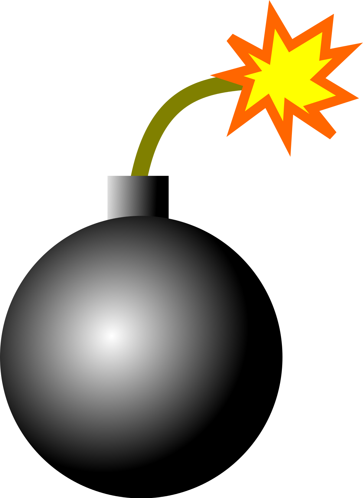

<p align="center">
  
</p>

<h1 align="center">Bomb Attack</h1>

<p align="center">Defuse the bomb — guess the secret number between 1 and 10 before the 10-second fuse burns out.</p>

---

## About

Bomb Attack is a small browser game built with plain HTML, CSS and JavaScript.
The program picks a random secret number from **1 to 10** and starts a **10-second
fuse**. You type guesses and get *higher / lower* hints; guess right in time and the
bomb is defused, run out of time and it explodes — complete with a canvas particle
blast, a white flash and an explosion sound.

## Features

- Random secret number (1–10) with higher/lower hints
- 10-second animated fuse and timer ring
- Canvas-based spark and explosion effects
- Win / lose states with sound (`explosion.mp3`)
- No build step and no dependencies — just static files

## Tech

- HTML5 (`<canvas>`, Web Audio)
- CSS3 (animations, custom fonts via Google Fonts)
- Vanilla JavaScript (`requestAnimationFrame` loop)

## Run it

Clone the repository and open `index.html` in any modern browser:

```sh
git clone https://github.com/olivierluethy/Bomb-Attack.git
cd Bomb-Attack
```

Then double-click `index.html` (or serve the folder with any static web server).

## How to play

1. A secret number between 1 and 10 is chosen and the fuse lights.
2. Enter a guess — the game tells you if the target is higher or lower.
3. Find the number before the fuse runs out to defuse the bomb.
